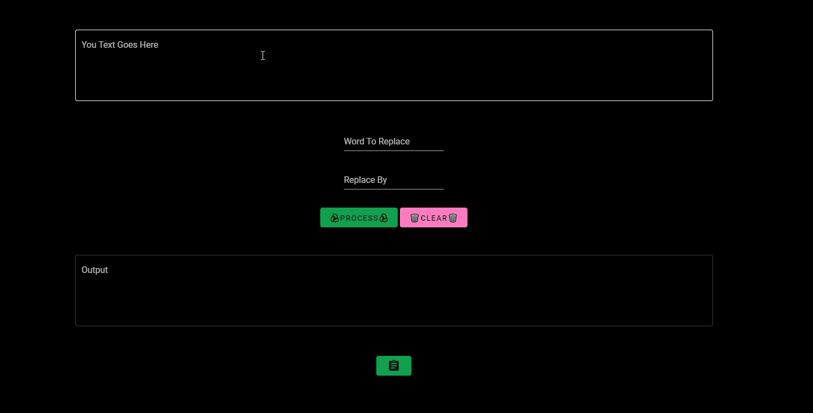

# Word ♻️ Replacer

<div align="center">
Replace a recurring word in your text with a simple click ⚡ ! 
</div>

### Made using :

<div align="center">
    
    
</div>

### Demo :

<div align="center">
    
</div>

### Build Setup

```bash
# install dependencies
$ npm install

# serve with hot reload at localhost:3000
$ npm run dev

# build for production and launch server
$ npm run build
$ npm run start

# generate static project
$ npm run generate
```

# Contact

<div align="center">
<p>you can contact me at ZTF666@protonmail.ch or via my portfolio</p>

</div>

<div align="center">

<table>
  <tr>
    <td align="center"><a href="https://ztfportfolio.web.app/" target='_blank'><br /><sub><b>ZTF666</b></sub></a></td>
  </tr>
</table>

</div>

## License

<div align="center">

**Word ♻️ Replacer**
released under the [MIT](LICENSE) License.
<br><br>

<strong><p>Made with 🖤 by ZTF - N.EA | 2021 </p> </strong>

</div>
